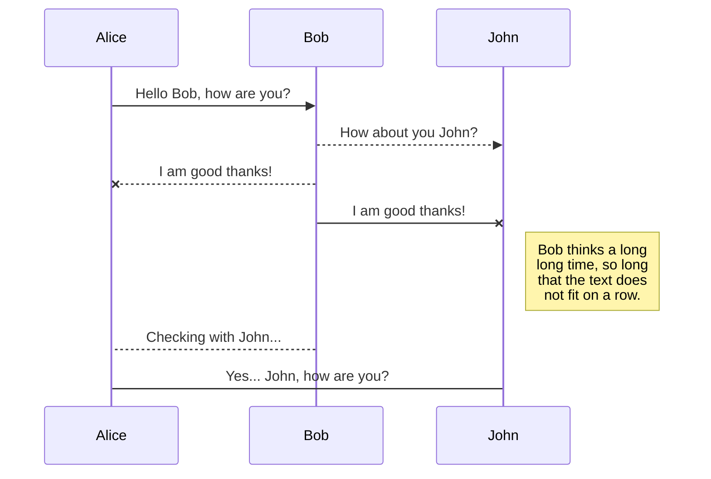
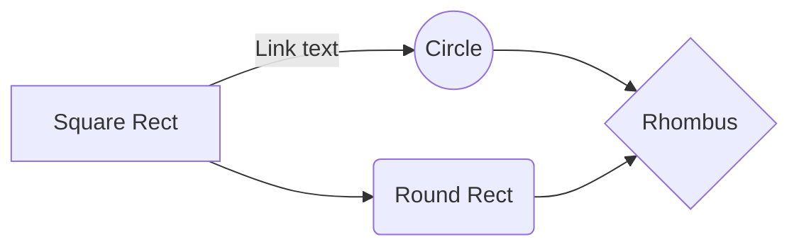

# Welcome to PRISM™!

# User Guide

---

## Index

1. Getting Started

    1.1 Login

2. User Tokens

    2.1 Generating Tokens as Admin

    2.2 Generating Cloud Tokens
    
    2.3 Retrieving Cloud Tokens
    
    2.4 QR Scanner

3. Controller Functions

    3.1 Connecting to PRISM™ device
    
    3.2 Open Lock, Close Lock, Stand Down
    
    3.3 Diagnostics and Reports
    
    3.4 Debug Mode

4. Admin

    4.1 User Admin
    
        4.1.1 Add Users
    
        4.1.2 Edit Users
    
        4.1.3 Delete Users
    
    4.2 Site Admin

        4.2.1 Commission Site
    
        4.2.2 Edit Site
    
            4.2.2.1 Add User to Site
    
            4.2.2.2 Remove User from Site
    
            4.2.3 Delete Site

---

# 1. Getting Started

Using and Android mobile device, open Chrome browser and navigate to the Prism URL [here](https://prism-v2-df011.web.app)

> **Tip** Install the site to *Home Screen* to use Prism as a *Native App*

## 1.1 Login

Enter your username/email and password then click on login to start using the Prism App.

  

You will be greeted with a welcome screen. From here, you can click on the menu button in the top left corner to navigate to the desired functionalities.

# 2. User Tokens

User Tokens are an essential part of the Prism App and are used to communicate securely with Prism devices.  Without valid and secure tokens you will not be able to control any functionalities on the Prism device.  To Retrieve or Generate tokens, open the menu and navigate to *User Tokens*

## 2.1 Generating Tokens as Admin

As an Admin user, clicking on the *Generate Tokens* button will open the token generation screen where you can select a site to generate tokens for the current user. 
 - If tokens were generated successfully the app will display a notification for tokens generated and for which site.

  

## 2.2 Generating Cloud Tokens

As an Admin user, you can generate tokens and store them in the cloud for the selected user.
 - Once tokens are created you will be notified and the selected user can later retrieve their cloud tokens.

   

 ## 2.3 Retrieving Cloud Tokens

 By clicking on the *Get Tokens* button, the user is greeted with a screen with a button to retrieve their cloud tokens.
  - Clicking on the *Retrieve Tokens* button, the user will be notified whether they have loaded the new tokens or if no tokens were available.
  - If no tokens are available an Admin user can generate new tokens (Refer to **2.2**)

   

  ## 2.4 QR Scanner
  
  By clicking on the *QR Scanner* button, the user has an option to either scan a valid QR Code with the camera or uploading a QR Code image file to read the contents and automatically load tokens.

  > **Note:** Only valid Token QR Codes will be read by the scanner - it will not work with any other type of QR Codes

# Markdown extensions

StackEdit extends the standard Markdown syntax by adding extra **Markdown extensions**, providing you with some nice features.

> **ProTip:** You can disable any **Markdown extension** in the **File properties** dialog.

## SmartyPants

SmartyPants converts ASCII punctuation characters into "smart" typographic punctuation HTML entities. For example:

|                |ASCII                          |HTML                         |
|----------------|-------------------------------|-----------------------------|
|Single backticks|`'Isn't this fun?'`            |'Isn't this fun?'            |
|Quotes          |`"Isn't this fun?"`            |"Isn't this fun?"            |
|Dashes          |`-- is en-dash, --- is em-dash`|-- is en-dash, --- is em-dash|

## KaTeX

You can render LaTeX mathematical expressions using [KaTeX](https://khan.github.io/KaTeX/):

The *Gamma function* satisfying $\Gamma(n) = (n-1)!\quad\forall n\in\mathbb N$ is via the Euler integral

$$
\Gamma(z) = \int_0^\infty t^{z-1}e^{-t}dt\,.
$$

> You can find more information about **LaTeX** mathematical expressions [here](http://meta.math.stackexchange.com/questions/5020/mathjax-basic-tutorial-and-quick-reference).

## UML diagrams

You can render UML diagrams using [Mermaid](https://mermaidjs.github.io/). For example, this will produce a sequence diagram:

And this will produce a flow chart:

