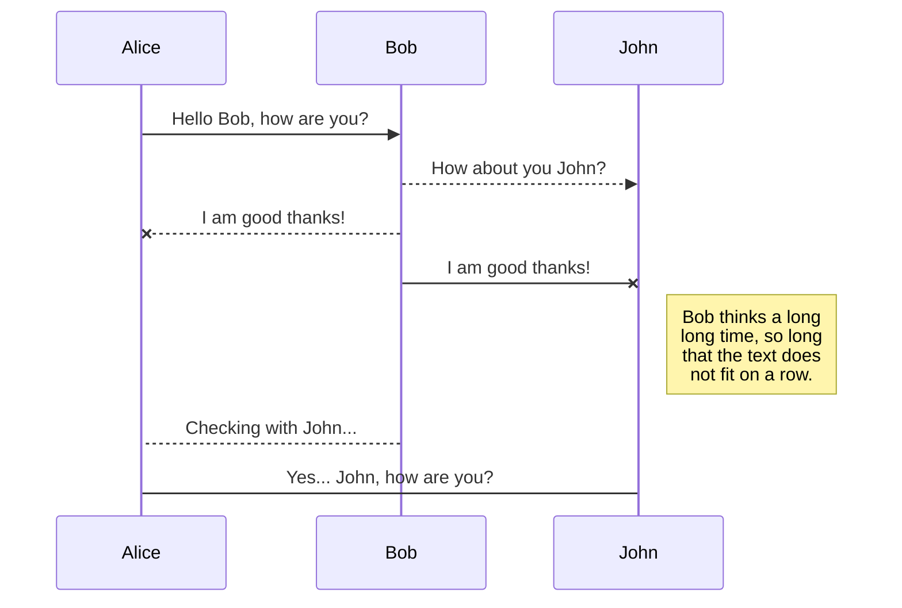
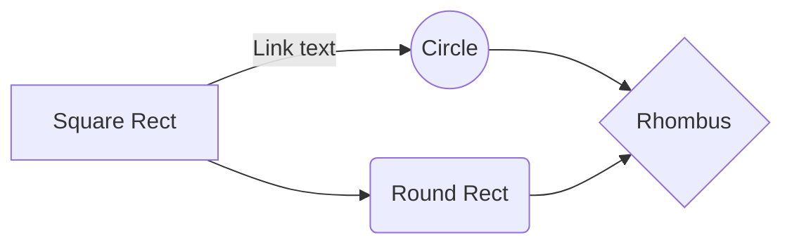

# Welcome to PRISM™!

# User Guide
## Index

1. Getting Started
	1.1 Login
2. User Tokens
	2.1 Generating Tokens as Admin
	2.2 Generating Cloud Tokens
	2.3 Retrieving Cloud Tokens
	2.4 QR Scanner
3. Controller Functions
	3.1 Connecting to PRISM™ device
	3.2 Open Lock, Close Lock, Stand Down
	3.3 Diagnostics and Reports
	3.4 Debug Mode
4. Admin
	4.1 User Admin
		4.1.1 Add Users
		4.1.2 Edit Users
		4.1.3 Delete Users
	4.2 Site Admin
		4.2.1 Commission Site
		4.2.2 Edit Site
			 4.2.2.1 Add User to Site
			 4.2.2.2 Remove User from Site
			4.2.3 Delete Site

1. Getting Started

# Markdown extensions

StackEdit extends the standard Markdown syntax by adding extra **Markdown extensions**, providing you with some nice features.

> **ProTip:** You can disable any **Markdown extension** in the **File properties** dialog.

## SmartyPants

SmartyPants converts ASCII punctuation characters into "smart" typographic punctuation HTML entities. For example:

|                |ASCII                          |HTML                         |
|----------------|-------------------------------|-----------------------------|
|Single backticks|`'Isn't this fun?'`            |'Isn't this fun?'            |
|Quotes          |`"Isn't this fun?"`            |"Isn't this fun?"            |
|Dashes          |`-- is en-dash, --- is em-dash`|-- is en-dash, --- is em-dash|

## KaTeX

You can render LaTeX mathematical expressions using [KaTeX](https://khan.github.io/KaTeX/):

The *Gamma function* satisfying $\Gamma(n) = (n-1)!\quad\forall n\in\mathbb N$ is via the Euler integral

$$
\Gamma(z) = \int_0^\infty t^{z-1}e^{-t}dt\,.
$$

> You can find more information about **LaTeX** mathematical expressions [here](http://meta.math.stackexchange.com/questions/5020/mathjax-basic-tutorial-and-quick-reference).

## UML diagrams

You can render UML diagrams using [Mermaid](https://mermaidjs.github.io/). For example, this will produce a sequence diagram:

And this will produce a flow chart:

