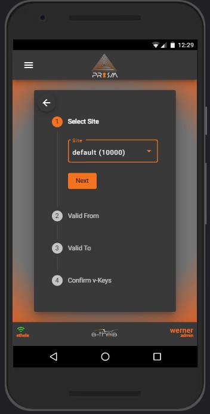
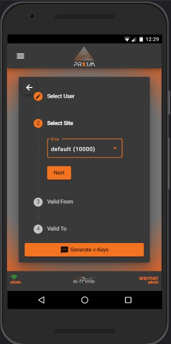
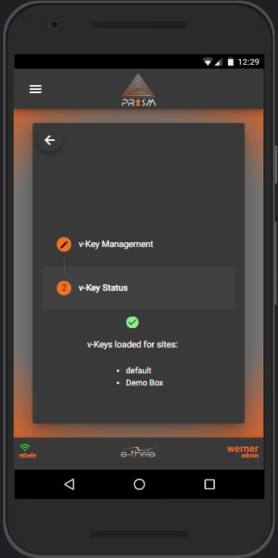

# Welcome to PRISM™!

# User Guide

---

## Index

1. [Getting Started](#gettingStarted) 

    1.1. [Login](#1.1)

2. [User Tokens](#userTokens)

    2.1. [Generating Tokens as Admin](#2.1) 

    2.2. [Generating Cloud Tokens](#2.2)
    
    2.3. [Retrieving Cloud Tokens](#2.3)
    
    2.4. [QR Scanner](#2.4)

3. [Controller Functions](#controllerFunctions)

    3.1. [Connecting to PRISM™ device](#3.1)
    
    3.2. [Open Lock, Close Lock, Stand Down](#3.2)
    
    3.3. [Diagnostics and Reports](#3.3)
    
    3.4. [Debug Mode](#3.4)

4. [Admin](#admin)

    4.1. [User Admin](#4.1)
    
     4.1.1. [Add Users](#4.1.1)
    
     4.1.2. [Edit Users](#4.1.2)
    
     4.1.3. [Delete Users](#4.1.3)
    
    4.2. [Site Admin](#4.2)

     4.2.1. [Commission Site](#4.2.1)
    
     4.2.2. [Edit Site](#4.2.2)

      4.2.2.1. [Add User to Site](#4.2.2.1)
 
      4.2.2.2. [Remove User from Site](#4.2.2.2)
    
     4.2.3. [Delete Site](#4.2.3)

---

# 1. Getting Started 

Using and Android mobile device, open Chrome browser and navigate to the Prism URL [here](https://prism-v2-df011.web.app)

> **Tip** Install the site to *Home Screen* to use Prism as a *Native App*

## 1.1 Login 

Enter your username/email and password then click on login to start using the Prism App.

You will be greeted with a welcome screen. From here, you can click on the menu button in the top left corner to navigate to the desired functionalities.

---

# 2. User Tokens 

User Tokens are an essential part of the Prism App and are used to communicate securely with Prism devices.  Without valid and secure tokens you will not be able to control any functionalities on the Prism device.  To Retrieve or Generate tokens, open the menu and navigate to *User Tokens*

## 2.1 Generating Tokens as Admin 

As an Admin user, clicking on the *Generate Tokens* button will open the token generation screen where you can select a site to generate tokens for the current user. 
 - If tokens were generated successfully the app will display a notification for tokens generated and for which site.

  

## 2.2 Generating Cloud Tokens 

As an Admin user, you can generate tokens and store them in the cloud for the selected user.
 - Once tokens are created you will be notified and the selected user can later retrieve their cloud tokens.

  

## 2.3 Retrieving Cloud Tokens 

By clicking on the *Get Tokens* button, the user is greeted with a screen with a button to retrieve their cloud tokens.
 - Clicking on the *Retrieve Tokens* button, the user will be notified whether they have loaded the new tokens or if no tokens were available.
 - If no tokens are available an Admin user can generate new tokens (Refer to **2.2**)

 

## 2.4 QR Scanner 
  
By clicking on the *QR Scanner* button, the user has an option to either scan a valid QR Code with the camera or uploading a QR Code image file to read the contents and automatically load tokens.

  > **Note:** Only valid Token QR Codes will be read by the scanner - it will not work with any other type of QR Codes

---

# 3. Controller Functions 

The *Controller Functions* screen is the central management and control interface for communication with the Prism device.

## 3.1 Connecting to PRISM™ device 

To connect to the Prism Device via bluetooth click on *Connect*.
 - The user will have the opportunity to select the available Prism devices from a popup list

   

## 3.2 Open Lock, Close Lock, Stand Down 

Once the device is connected, the user will see a control panel for the device which is used for controlling the Prism unit. 

- *Open* Unlocks the unit
- *Lock* Locks the unit
- *Stand Down* Starts the standing down flow. This will cause the unit to run through some tests to ensure that the site and unit is secured and that the unit is still in working condition. If all the tests succeed the user's tokens will be revoked and the user can leave the site.

- *Buzz* will set off the buzzer if it is available on the unit. This can be used if a user is unsure if the device is connected or working correctly.
- *Configure* will open the unit configuration screen
- *Debug* will open the Debug screen
- *Diagnostics* will open the Diagnostics screen
- *Disconnect* will disconnect the device from the Prism unit

## 3.3 Diagnostics and Reports 

From the *Diagnostics* screen the user can run through the different component tests, which will show the current working condition of said components.
- A PDF Report is created and downloaded to the user's device when the *Generate Report* button is pressed.

## 3.4 Debug Mode 

From the *Debug* screen a user can send *Plain Text* messages to the connected unit.

> **Note:** This is not available to all users and must be used with extreme caution!

---

# 4. Admin 

From the *Admin* screen, a user can update Site and User settings by pressing the respective buttons.

## 4.1 User Admin 

From this screen, users can be *added*, *modified* or *deleted*.
- To add a user, press on the top right *add* button
- To modify a user, press on the *pencil* button in the table
- To delete a user, press on the *trashcan* button in the table

### 4.1.1 Add Users 

When adding a user, the below screen is shown. The password must be shared only with the user being added.

Field Requirements:

|FIELD                   |REQUIRED/OPTIONAL         |
|------------------------|--------------------------|
|Username                |Required                  |
|Password                |Required                  |
|Admin                   |Required                  |
|Can Generate Tokens     |Required                  |
|Cellphone               |Optional                  |

### 4.1.2 Edit Users 

The *Edit User* screen, allows to update a user's Admin status and Token Generation ability.
- *Reset Password* resets the user's password to the default password

### 4.1.3 Delete Users 

When pressing the *delete* button on the *User Admin* screen, will create a popup confirmation of the deletion

## 4.2 Site Admin 

The *Site Admin* screen will show all available sites to the user. From here a user can *Commission* a new site, *Update* an existing site's users and *Delete* sites. 

> Please be aware that *Deleting* sites have consequences as once a site has been commissioned, all tokens and users that were enrolled for that site are decommissioned and invalid.

### 4.2.1 Commission Site 

When adding/commissioning a site, the user must enter the *Site Name* as well as the *Site Key*. The avarage user however will not be tasked with commissioning sites - rather the technicians.

### 4.2.2 Edit Site 

When editing a site's users, the user can only *add* or *remove* users from that site.
- Removing a user from a site does not completely delete the user, so they can be added again at a later stage

#### 4.2.2.1. Add User to Site 

Adding a user to a site, a user must be selected from the dropdown list.

#### 4.2.2.2. Remove User from Site 

Removing a user from a site will create a popup confirmation of the removal of the selected user

#### 4.2.3. Delete Site 

Deleting a site will create a popup confirmation of the removal of the selected site

> **Note:** Use this with extreme caution

---

 
